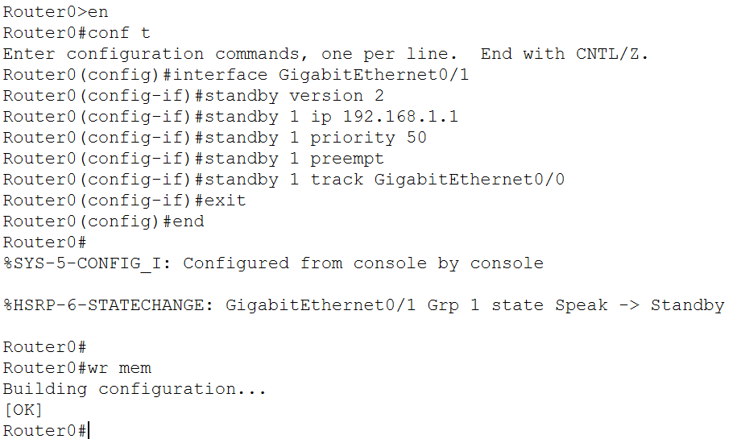
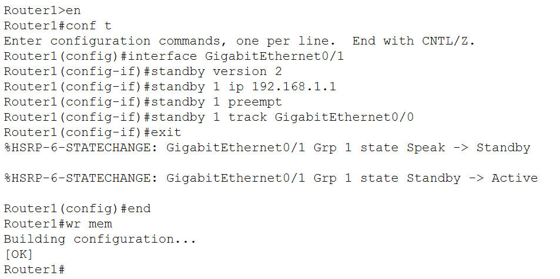
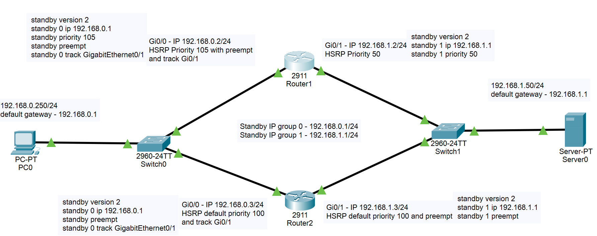
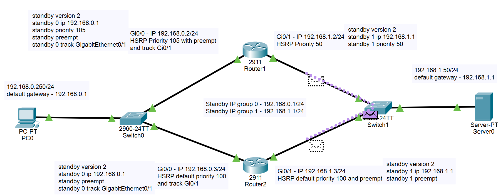
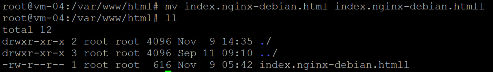

# Домашнее задание к занятию "`Disaster recovery и Keepalived»`" - `Илларионов Дмитрий`

## Цель задания

В результате выполнения этого задания вы научитесь:

    Настраивать отслеживание интерфейса для протокола HSRP;
    Настраивать сервис Keepalived для использования плавающего IP

# Задание 1

    Дана схема для Cisco Packet Tracer, рассматриваемая в лекции.
    На данной схеме уже настроено отслеживание интерфейсов маршрутизаторов Gi0/1 (для нулевой группы)
    Необходимо аналогично настроить отслеживание состояния интерфейсов Gi0/0 (для первой группы).
    Для проверки корректности настройки, разорвите один из кабелей между одним из маршрутизаторов и Switch0 и запустите ping между PC0 и Server0.
    На проверку отправьте получившуюся схему в формате pkt и скриншот, где виден процесс настройки маршрутизатора.

## Решение

Командой смотрю настройки исходные:

```
Router1#show startup-config 
```

### Исходные (как было ) настройки верхнего роутреа

```
interface GigabitEthernet0/0
ip address 192.168.0.2 255.255.255.0
duplex auto
speed auto

standby version 2
standby 0 ip 192.168.0.1
standby priority 105
standby preempt
standby 0 track GigabitEthernet0/1
!
interface GigabitEthernet0/1
ip address 192.168.1.2 255.255.255.0
duplex auto
speed auto

standby version 2
standby 1 ip 192.168.1.1
standby 1 priority 50
``` 

### Исходные (как было) настройки нижнего ротуреа
```
interface GigabitEthernet0/0
ip address 192.168.0.3 255.255.255.0
duplex auto
speed auto

standby version 2
standby 0 ip 192.168.0.1

standby preempt
standby 0 track GigabitEthernet0/1
!
interface GigabitEthernet0/1
ip address 192.168.1.3 255.255.255.0
duplex auto
speed auto

standby version 2
standby 1 ip 192.168.1.1
standby 1 preempt

```

### Анализ исходных  настроек

Для решения считаю, что нужно добавить команды для верхнего роутера:

```
standby 1 preempt
standby 1 track GigabitEthernet0/0
```

А на нижнем роутере добавить:

```
standby 1 track GigabitEthernet0/0
```

#### Добавление команд на роутерах

Добавил команды на верхнем роутере:

```
Router0>en
Router0#conf t
Enter configuration commands, one per line.  End with CNTL/Z.
Router0(config)#interface GigabitEthernet0/1
Router0(config-if)#standby version 2
Router0(config-if)#standby 1 ip 192.168.1.1
Router0(config-if)#standby 1 priority 50
Router0(config-if)#standby 1 preempt
Router0(config-if)#standby 1 track GigabitEthernet0/0
Router0(config-if)#exit
Router0(config)#end
Router0#
%SYS-5-CONFIG_I: Configured from console by console
```

Добавил команды на нижнем роутере:

```
Router1>en
Router1#conf t
Enter configuration commands, one per line.  End with CNTL/Z.
Router1(config)#interface GigabitEthernet0/1
Router1(config-if)#standby version 2
Router1(config-if)#standby 1 ip 192.168.1.1
Router1(config-if)#standby 1 preempt
Router1(config-if)#standby 1 track GigabitEthernet0/0
Router1(config-if)#exit
%HSRP-6-STATECHANGE: GigabitEthernet0/1 Grp 1 state Speak -> Standby

%HSRP-6-STATECHANGE: GigabitEthernet0/1 Grp 1 state Standby -> Active

Router1(config)#end
```

Потом еще на обоих роутерах выполнил:

```
Router0#wr mem
Building configuration...
[OK]
```

```
Router1#wr mem
Building configuration...
[OK]
Router1#
```

Картинка настроек:

Верхний роутер:




Нижний роутер:



Схема такая:




Пока не понял - как проверить на симуляторе, что не возвращается Активный IP без этих настроек.

### Остались вопросы

Пробовал пинг делать с правого сервера на левый ПК:


Потом разорвал нижнне правый линк от нижнего роутера к серверу.
Почему после восстановления связи сигнал идет к обоим ротуерам - пробовал много раз подряд:



Плюс пробовал - если и не делать настроек, то, все равно вовзращалась работоспособность при восстановления линка. 


# Задание 2

    Запустите две виртуальные машины Linux, установите и настройте сервис Keepalived как в лекции, используя пример конфигурационного файла.
    Настройте любой веб-сервер (например, nginx или simple python server) на двух виртуальных машинах
    Напишите Bash-скрипт, который будет проверять доступность порта данного веб-сервера и существование файла index.html в root-директории данного веб-сервера.
    Настройте Keepalived так, чтобы он запускал данный скрипт каждые 3 секунды и переносил виртуальный IP на другой сервер, если bash-скрипт завершался с кодом, отличным от нуля (то есть порт веб-сервера был недоступен или отсутствовал index.html). Используйте для этого секцию vrrp_script
    На проверку отправьте получившейся bash-скрипт и конфигурационный файл keepalived, а также скриншот с демонстрацией переезда плавающего ip на другой сервер в случае недоступности порта или файла index.html

## Решение

### bash скрипт

на обоих серверах скрипт одинаковый:

```
#!/bin/bash

if [[ -f /var/www/html/index.nginx-debian.html ]] && bash -c "</dev/tcp/localhost/80"; then
        echo "Good" >&1
        exit 0
else
        echo "Not good" >&2
        exit 1
fi
```

### Конфигурационный файл

На главном сервере:

```
vrrp_script check {
    script "/usr/local/bin/check.sh"
    interval 3
    rise 3
}
vrrp_instance VI_1 {
  state MASTER
  interface eth0
  virtual_router_id 52
  priority 255
  advert_int 1

  virtual_ipaddress {
    192.168.1.52/24
  }
    track_script {
        check
    }
}
```

На резервном сервере:

```
vrrp_script check {
   script /usr/local/bin/check.sh
   interval 3
   rise 3
}

vrrp_instance VI_1 {
  state BACKUP
  interface eth0
  virtual_router_id 52
  priority 200
  advert_int 1

  virtual_ipaddress {
    192.168.1.52/24
  }
  track_script {
    check
  }
}
```

###  скриншот с демонстрацией переезда плавающего ip на другой сервер в случае недоступности порта или файла index.html

Портим файл для имитации сбоя:



На главном сервере сайт не работает:


На втором работает и  на плавающем IP работает:


# Дополнительные задания со звёздочкой*

Эти задания дополнительные. Их можно не выполнять. На зачёт это не повлияет. Вы можете их выполнить, если хотите глубже разобраться в материале.
Задание 3*

    Изучите дополнительно возможность Keepalived, которая называется vrrp_track_file
    Напишите bash-скрипт, который будет менять приоритет внутри файла в зависимости от нагрузки на виртуальную машину (можно разместить данный скрипт в cron и запускать каждую минуту). Рассчитывать приоритет можно, например, на основании Load average.
    Настройте Keepalived на отслеживание данного файла.
    Нагрузите одну из виртуальных машин, которая находится в состоянии MASTER и имеет активный виртуальный IP и проверьте, чтобы через некоторое время она перешла в состояние SLAVE из-за высокой нагрузки и виртуальный IP переехал на другой, менее нагруженный сервер.
    Попробуйте выполнить настройку keepalived на третьем сервере и скорректировать при необходимости формулу так, чтобы плавающий ip адрес всегда был прикреплен к серверу, имеющему наименьшую нагрузку.
    На проверку отправьте получившийся bash-скрипт и конфигурационный файл keepalived, а также скриншоты логов keepalived с серверов при разных нагрузках

Правила приема работы

    Необходимо следовать инструкции по выполнению домашнего задания, используя для оформления репозиторий Github
    В ответе необходимо прикладывать требуемые материалы - скриншоты, конфигурационные файлы, скрипты. Необходимые материалы для получения зачета указаны в каждом задании.

Критерии оценки

    Зачет - выполнены все задания, ответы даны в развернутой форме, приложены требуемые скриншоты, конфигурационные файлы, скрипты. В выполненных заданиях нет противоречий и нарушения логики
    На доработку - задание выполнено частично или не выполнено, в логике выполнения заданий есть противоречия, существенные недостатки, приложены не все требуемые материалы.
